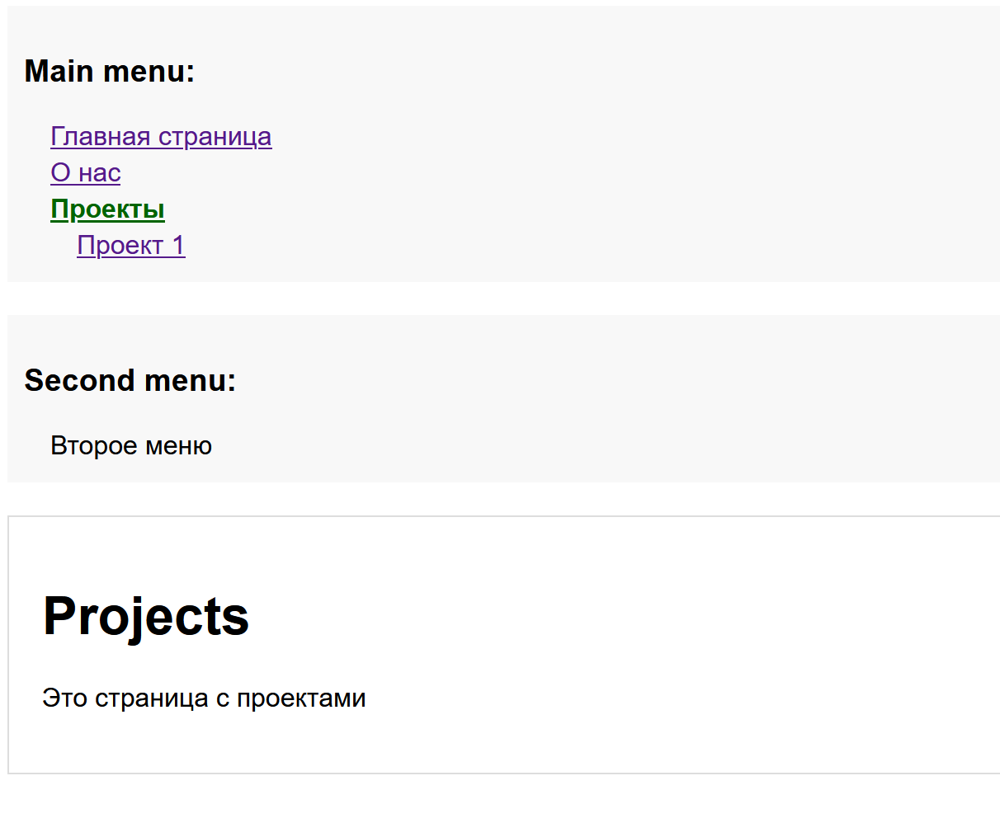
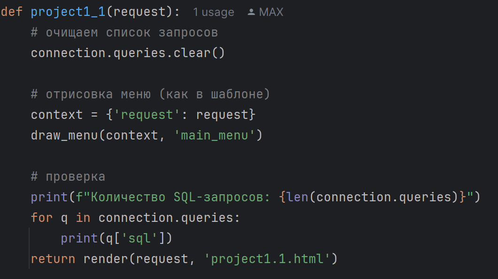

# Django Tree-menu

Проект демонстрирует работу **древовидного меню** на Django с хранением пунктов в базе данных и отрисовкой через template tag.  
Меню поддерживает **произвольную вложенность**, активный пункт определяется по текущему URL, все предки активного пункта развёрнуты, а первый уровень детей активного пункта раскрыт.

---

## Функционал

- Хранение меню в базе данных через модели `Menu` и `MenuItem`
- Поддержка нескольких меню на одной странице (`menu_name`)
- Активный пункт определяется автоматически по URL
- Все предки активного пункта развёрнуты
- Первый уровень детей активного пункта раскрыт
- Рендер меню через template tag ``
- Один SQL-запрос на отрисовку меню

---

## Установка и запуск

1. Клонируем репозиторий:

```bash
git clone https://github.com/Maximkapp/test_task_tree_menu.git
cd tree_menu
```
2. Создаём виртуальное окружение и активируем его:
```bash
python -m venv .venv
# Windows
.venv\Scripts\activate
# Linux / Mac
source .venv/bin/activate
```
3. Устанавливаем зависимости:

```bash
pip install django
```

4. Создаем и применяем миграции

```bash
python manage.py makemigrations 
python manage.py migrate
```

5. Создаём суперпользователя для админки:

```bash
python manage.py createsuperuser
```

6. Запускаем сервер:

```bash
python manage.py runserver
```

7. Открываем в браузере:

```bash
http://127.0.0.1:8000/admin/
```

8. Добавляем меню и пункты через админку (Menu и MenuItem).

Пример структуры меню для тестирования:
```bash
Главная          → /
О нас            → /about/
Проекты          → /projects/
    Проект 1     → /projects/project1/
        Проект 1.1 → /projects/project1/project1-1/
```

9. В шаблонах используем

```bash


```

В моём примере это реализовано в базовом шаблоне ```base.html```. Также в примере я показываю второе меню


## Примеры работы
Главная страница


Страница "Проекты"


Страница "Проект 1"


Пример заполнения админки

## Проверка, что запрос к бд 1


